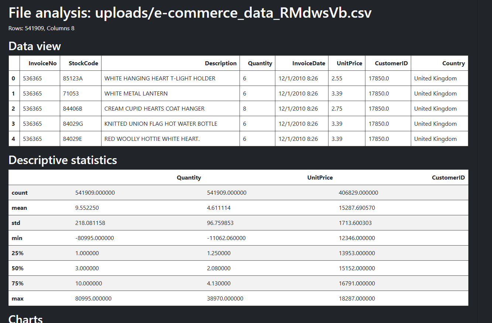
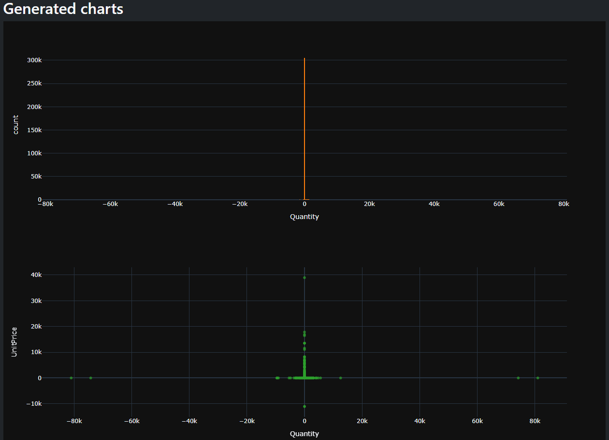

# CSV Analyzer Django


___

## **Project description**
This project is a web application in Django for uploading, analyzing and managing CSV files. Users can upload their own files, check their upload history and analyze data by using Pandas library.

___

## **Features**
* Registration and logging users
* Uploading CSV files
* CSV validation (headers, numeric columns check)
* History of sent files for user ("My uploads")
* User-specific file access (each user sees only their uploads)
* Basic data analysis via Pandas
  * First rows view
  * Basic stats
* Optional charts with option for column X and Y choose
  * Histogram
  * Scatter plot
  * Line plot
  * Box plot
* Bootstrap 5 dark mode interface based

___

## **Tech stack**
* #### Backend: Django 5, Python 3.13
* #### Frontend: Bootstrap 5 (dark mode)
* #### Database: SQLite
* #### Data analysis & visualization: Pandas, Plotly

___

## **How to run**

### 1. Clone repo

```bash
git clone https://github.com/Wrobelax/csv-analyzer.git
cd csv-analyzer
```

### 2. Create and activate venv
```bash
python -m venv .venv
source .venv/bin/activate #Linux/Mac
.venv\Scripts\activate
```

### 3. Install dependencies
```bash
pip install -r requirements.txt
```

### 4. Run migration
```bash
python manage.py migrate
```

### 5. Create superuser (optional)
```bash
python manage.py createsuperuser
```

### 6. Run server
```bash
python manage.py runserver
```

The app is available under http://127.0.0.1:8000


## **Screenshoots**

#### **Basic stats**


#### **Chart examples**


## **Conclusion**

CSV Analyzer is a simple but powerful Django-based web application for working with CSV data.
It combines user management, file uploads, and interactive analysis with Pandas and Plotly into one tool with a clean Bootstrap 5 dark mode interface.
This project can serve as an example of Django full-stack development (views, models, templates and authentication) but also as a base for more advanced data analysis tools. This was created mostly for learning purposes of web development with Python and related libraries.